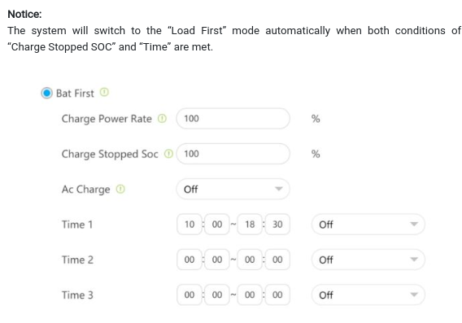

# Important Modbus Registers for RS485 on SPH 10000 TL3-BH-UP

## external links:
- [https://www.photovoltaikforum.com/core/attachment/265072-pdfcoffee-com-growatt-inverter-modbus-rtu-protocolii-v120-english-pdf-free-pdf/](https://www.photovoltaikforum.com/core/attachment/265072-pdfcoffee-com-growatt-inverter-modbus-rtu-protocolii-v120-english-pdf-free-pdf/)
- [https://www.photovoltaikforum.com/thread/192228-growatt-sph-modbus-rtu-rj45-pinout-und-register-beschreibung/?pageNo=1](https://www.photovoltaikforum.com/thread/192228-growatt-sph-modbus-rtu-rj45-pinout-und-register-beschreibung/?pageNo=1)
- [https://github.com/nygma2004/growatt2mqtt/blob/main/Growatt%20PV%20Inverter%20Modbus%20RS485%20RTU%20Protocol%20v120.pdf](https://github.com/nygma2004/growatt2mqtt/blob/main/Growatt%20PV%20Inverter%20Modbus%20RS485%20RTU%20Protocol%20v120.pdf)
- [https://forum.iobroker.net/assets/uploads/files/1550402978050-growatt-pv-inverter-modbus-rs485-rtu-protocol-v3.05-%E5%AE%A2%E6%88%B7%E7%89%88.pdf](https://forum.iobroker.net/assets/uploads/files/1550402978050-growatt-pv-inverter-modbus-rs485-rtu-protocol-v3.05-%E5%AE%A2%E6%88%B7%E7%89%88.pdf)

## Ranges on SPH-Series
- Register 03: 0-124,1000-1124
- Register 04: 0-124,1000-1124

|Mode|Description|Register Type|Register Number|Unit/Info|
|---|---|---|---|---|
|Read|Battery min SoC on Bat. First mode|Holding|608|%|
|Read/Write|Battery max SoC|Holding|1091|%|
|Read|Battery momentary SoC|Input|1014|%|
|Read|System work mode|Input|1000|Value 1-5|
|Read|Battery momentary temperature|input|1089|0.1 °C|
|Read|Battery type|Input|119|0=Lead Acid, 1=Lithium|
|Read|Priority|Input|118|0=Load First, 1=Battery First, 2=Grid First|
|Read|Priority|Holding|1044|0=Load first, 1=Battery First, 2=Grid First|
|Read/Write|Battery First On/Off Timer 1|Holding|1102|1=On, 0=Off|
|Read/Write|Battery First On/Off Timer 2|Holding|1105|1=On, 0=Off|
|Read/Write|Battery First On/Off Timer 3|Holding|1108|1=On, 0=Off|
|Read|Modbus-Version|Holding|88|Versionnumber eg. 305 = 3.05|

## Manual Charge Battery from AC
In order to prioritize charging the battery (e.g. in timer with low energy prices), this can be achieved by a few commands.

SPH-inverters are using Timeschedules for this.   
  
*[https://www.energetica-india.net/articles/guidance-for-operation-modes-of-the-sph-series-inverter](https://www.energetica-india.net/articles/guidance-for-operation-modes-of-the-sph-series-inverter)*

- Set SoC-Limit: e.g. 1091 -> 70
    - This will set the charging limit in Batter-First-Mode to e.g. 70%
- Enable AC-Charging: e.g. 1092 -> 1
    - This will enable charging from AC (disabled when set to 0)
- Set Start Time: e.g. 1100 -> 5175 (20:55)
    - The start time is an 16bit integer, where the high-byte represents the hour and the low byte the minute. You may use [combine_int.py](combine_int.py) to convert those values.
- Set Stop Time: e.g. 1101 -> 5381 (21:05)
    - The stop time is again an 16bit integer, where the high-byte represents the hour and the low byte the minute.
- Enable Timer: e.g. 1102 -> 1
    - This will enable the timer. (The timer will not be disabled automatically. You have to disable it manually after the stop-time)

- query the local inverter time:
    - Read 48 = Hour
    - Read 49 = Minute
    - By writing values, this could also be set